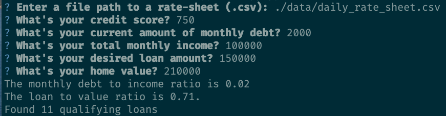

# Loan Analyzer

This is a python program to qualify a user for sample loans based off of prompted inputs.

---

## Technologies

This project leverages Python 3.7 with the following packages:

* [Csv](https://docs.python.org/3.7/library/csv.html) - For reading and writing to CSV

* [Questionary](https://docs.python.org/3.7/library/pathlib.html) - For navigating filepaths on local os

---

## Installation Guide

Before running the application, first install the following dependencies.

```python
  pip install python-csv
  pip install pathlib
```

---

## Examples

Upon running the analyzer, you will see the current output based on the values in the loan variables.



---

## Usage

To use the loan qualifier application, clone the repository and run the **loan_qualifier.py** with the following:

```python
python loan_qualifier.py
```

---

## Contributors

Pull requests are welcome. For major changes, please open an issue first to discuss what you would like to change.

Please make sure to update tests as appropriate.

---

## License

N/A
